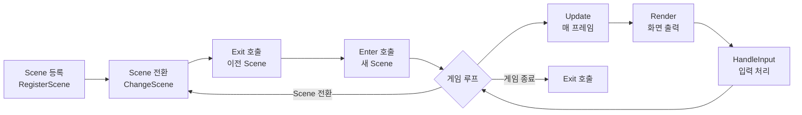

# Scene 구현 가이드

## 📋 목차
1. [개요](#-개요)
2. [Scene 시스템 구조](#-scene-시스템-구조)
3. [구현해야 할 Scene 목록](#-구현해야-할-scene-목록)
4. [Scene 구현 단계별 가이드](#-scene-구현-단계별-가이드)
5. [Manager 활용 방법](#-manager-활용-방법)
6. [실전 예제](#-실전-예제)
7. [주의사항 및 팁](#-주의사항-및-팁)

---

## 📌 개요

이 문서는 **에레보스 타워** 프로젝트의 Scene 구현을 위한 종합 가이드입니다.  
팀원들은 이 문서를 참고하여 각자 담당한 Scene을 구현할 수 있습니다.

### 현재 상태
- ✅ **완료**: MainMenuScene, PlayerNameInputScene
- ⏳ **구현 필요**: CharacterSelect, StageSelect, Battle, Shop, CompanionRecruit, StoryProgress, Result

### 필수 사전 지식
- C++17 기본 문법
- 클래스 상속 및 virtual 함수
- unique_ptr / shared_ptr 사용법
- dynamic_cast 사용법

---

## 🏗️ Scene 시스템 구조

### Scene 생명주기



### UIScene 베이스 클래스

```cpp
class UIScene
{
protected:
    UIDrawer* _Drawer;         // UI 렌더링
    InputManager* _Input;       // 사용자 입력
    bool _IsActive;          // Scene 활성화 상태
    std::string _SceneName;     // Scene 이름

public:
    UIScene(const std::string& name);
    virtual ~UIScene();

    // 필수 구현 (pure virtual)
 virtual void Enter() = 0;      // Scene 진입 시
    virtual void Exit() = 0;   // Scene 종료 시
    virtual void Update() = 0;     // 매 프레임 업데이트
    virtual void Render() = 0;     // 화면 렌더링

    // 선택적 구현
    virtual void HandleInput() {}  // 입력 처리

    // Getter
    bool IsActive() const { return _IsActive; }
    void SetActive(bool active) { _IsActive = active; }
    const std::string& GetName() const { return _SceneName; }
};
```

---

## 📝 구현해야 할 Scene 목록

| Scene | 담당자 | 우선순위 | 설명 |
|-------|--------|----------|------|
| **CharacterSelectScene** | ? | ⭐⭐⭐ | 직업 선택 (전사/마법사/궁수) |
| **StageSelectScene** | ? | ⭐⭐⭐ | 스테이지 선택 (일반/보스) |
| **BattleScene** | ? | ⭐⭐⭐ | 전투 화면 |
| **ShopScene** | ? | ⭐⭐ | 상점 (구매/판매) |
| **CompanionRecruitScene** | ? | ⭐⭐ | 동료 영입 |
| **StoryProgressScene** | ? | ⭐ | 스토리 진행 |
| **ResultScene** | ? | ⭐⭐ | 게임 결과 (승리/패배) |

---

## 🚀 Scene 구현 단계별 가이드

### 1단계: 헤더 파일 작성

**위치**: `include/UI/Scenes/YourScene.h`

```cpp
#pragma once
#include "../UIScene.h"

class YourScene : public UIScene
{
private:
    // Scene 전용 데이터 멤버
    // 예: int _CurrentSelection;

public:
 YourScene();
    ~YourScene() override;

    void Enter() override;
    void Exit() override;
    void Update() override;
    void Render() override;
    void HandleInput() override;
};
```

### 2단계: 구현 파일 작성

**위치**: `src/UI/Scenes/YourScene.cpp`

```cpp
#include "../../../include/UI/Scenes/YourScene.h"
#include "../../../include/UI/UIDrawer.h"
#include "../../../include/UI/Panel.h"
#include "../../../include/UI/TextRenderer.h"
#include "../../../include/Manager/SceneManager.h"
#include "../../../include/Manager/InputManager.h"

YourScene::YourScene()
    : UIScene("YourScene")
{
}

YourScene::~YourScene()
{
}

void YourScene::Enter()
{
    // 1. 화면 초기화
    _Drawer->ClearScreen();
    _Drawer->RemoveAllPanels();
    _Drawer->Activate();
    _IsActive = true;

    // 2. UI 패널 구성
    Panel* titlePanel = _Drawer->CreatePanel("Title", 0, 0, 106, 5);
    titlePanel->SetBorder(true, ETextColor::LIGHT_YELLOW);
    
    auto titleText = std::make_unique<TextRenderer>();
    titleText->AddLine("=== Your Scene Title ===");
    titleText->SetTextColor(static_cast<WORD>(ETextColor::LIGHT_YELLOW));
    titlePanel->SetContentRenderer(std::move(titleText));

    // 3. 첫 렌더링
    _Drawer->Render();
}

void YourScene::Exit()
{
    _Drawer->RemoveAllPanels();
_IsActive = false;
}

void YourScene::Update()
{
    if (_IsActive)
    {
        _Drawer->Update();
        HandleInput();
    }
}

void YourScene::Render()
{
    // UIDrawer::Update()에서 자동 렌더링
}

void YourScene::HandleInput()
{
    // 입력 처리 로직
}
```

### 3단계: GameManager에 등록

**위치**: `src/Manager/GameManager.cpp`

```cpp
#include "../../include/UI/Scenes/YourScene.h"

void GameManager::Initialize()
{
    // ...기존 코드...
    
  // 새 Scene 등록
    sm->RegisterScene(ESceneType::YourScene, std::make_unique<YourScene>());
}
```

### 4단계: ESceneType에 추가 (필요 시)

**위치**: `include/Manager/SceneManager.h`

```cpp
enum class ESceneType
{
    MainMenu,
    PlayerNameInput,
    YourScene,  // ← 추가
    // ...
};
```

---

## 🛠️ Manager 활용 방법

### UIDrawer - UI 렌더링

```cpp
#include "include/UI/UIDrawer.h"
#include "include/UI/Panel.h"
#include "include/UI/TextRenderer.h"
#include "include/UI/StatRenderer.h"

// 패널 생성
Panel* panel = _Drawer->CreatePanel("PanelID", x, y, width, height);
panel->SetBorder(true, ETextColor::LIGHT_CYAN);

// 텍스트 렌더러
auto textRenderer = std::make_unique<TextRenderer>();
textRenderer->AddLine("텍스트 내용");
textRenderer->SetTextColor(static_cast<WORD>(ETextColor::WHITE));
panel->SetContentRenderer(std::move(textRenderer));

// 스탯 렌더러
auto statRenderer = std::make_unique<StatRenderer>();
statRenderer->SetStat("HP", "100/100");
statRenderer->SetKeyColor(static_cast<WORD>(ETextColor::LIGHT_GREEN));
statRenderer->SetValueColor(static_cast<WORD>(ETextColor::LIGHT_YELLOW));
panel->SetContentRenderer(std::move(statRenderer));

// 렌더링
_Drawer->Render();
```

### InputManager - 사용자 입력

```cpp
#include "include/Manager/InputManager.h"

InputManager* input = InputManager::GetInstance();

// 문자열 입력
std::string name = input->GetInput("이름: ");

// 정수 입력 (범위 지정)
int choice = input->GetIntInput("선택 (1-3): ", 1, 3);

// 문자 입력 (유효 문자 지정)
char yn = input->GetCharInput("[Y/N]: ", "YNyn");

// 옵션 선택 (문자열 검증)
std::vector<std::string> jobs = {"전사", "마법사", "궁수"};
std::string job = input->GetStringInput("직업: ", jobs);

// Yes/No 입력
bool confirm = input->GetYesNoInput("계속하시겠습니까? ");

// 논블로킹 키 확인
if (input->IsKeyPressed())
{
    int keyCode = input->GetKeyCode();
    if (keyCode == 27)  // ESC
    {
        // 종료 처리
    }
}
```

### SceneManager - Scene 전환

```cpp
#include "include/Manager/SceneManager.h"

SceneManager* sm = SceneManager::GetInstance();

// Scene 전환
sm->ChangeScene(ESceneType::Battle);

// 플레이어 정보 가져오기
Player* player = sm->GetPlayer();
```

### GameManager - 파티 관리

```cpp
#include "include/Manager/GameManager.h"

GameManager* gm = GameManager::GetInstance();

// 메인 플레이어 설정
auto mainPlayer = std::make_shared<Player>("주인공", true);
gm->SetMainPlayer(mainPlayer);

// 동료 추가
auto companion = std::make_shared<Player>("동료", false);
gm->AddCompanion(companion);

// 파티 정보 가져오기
std::shared_ptr<Player> mainPlayer = gm->GetMainPlayer();
const auto& party = gm->GetParty();

// 파티원 수
size_t partySize = gm->GetPartySize();
size_t aliveCount = gm->GetAliveCount();

// 사망한 동료 제거
gm->RemoveDeadCompanions();
```

### BattleManager - 전투 관리

```cpp
#include "include/Manager/BattleManager.h"

BattleManager* bm = BattleManager::GetInstance();

// 전투 시작
bool success = bm->StartBattle(EBattleType::Normal);

// 1턴 실행 (Update에서 호출)
if (!bm->ProcessBattleTurn())
{
    // 전투 종료됨
    const BattleResult& result = bm->GetBattleResult();
    if (result.Victory)
    {
        // 승리 처리
    }
}

// 전투 종료
bm->EndBattle();

// 전투 상태 조회
bool isActive = bm->IsBattleActive();
IMonster* monster = bm->GetCurrentMonster();
```

### ShopManager - 상점 관리

```cpp
#include "include/Manager/ShopManager.h"

ShopManager* sm = ShopManager::GetInstance();

// 상점 열기
sm->ReopenShop("Items.csv");

// 상품 목록 가져오기
std::vector<ShopItemInfo> items = sm->GetShopItems();
for (const auto& item : items)
{
    std::cout << item.name << " - " << item.price << "G (재고: " << item.stock << ")" << std::endl;
}

// 구매
auto [success, message, goldChange, itemName] = sm->BuyItem(player, itemIndex);
if (success)
{
    std::cout << "구매 성공: " << itemName << std::endl;
}

// 판매
auto [success, message, goldChange, itemName] = sm->SellItem(player, slotIndex);
if (success)
{
    std::cout << "판매 성공: " << itemName << " (+" << goldChange << "G)" << std::endl;
}
```

---

## 💡 실전 예제

### 예제 1: CharacterSelectScene (직업 선택)

```cpp
void CharacterSelectScene::Enter()
{
    _Drawer->ClearScreen();
    _Drawer->RemoveAllPanels();
    _Drawer->Activate();
    _IsActive = true;

    // 타이틀
    Panel* titlePanel = _Drawer->CreatePanel("Title", 20, 5, 70, 5);
    titlePanel->SetBorder(true, static_cast<WORD>(ETextColor::LIGHT_YELLOW));
  auto titleText = std::make_unique<TextRenderer>();
    titleText->AddLine("");
    titleText->AddLine("    === 직업 선택 ===");
    titleText->SetTextColor(static_cast<WORD>(ETextColor::LIGHT_YELLOW));
    titlePanel->SetContentRenderer(std::move(titleText));

    // 직업 정보
    Panel* infoPanel = _Drawer->CreatePanel("Info", 20, 12, 70, 15);
infoPanel->SetBorder(true, static_cast<WORD>(ETextColor::LIGHT_CYAN));
    auto infoText = std::make_unique<TextRenderer>();
    infoText->AddLine("");
    infoText->AddLine("   [W] 전사 - 높은 체력과 방어력");
    infoText->AddLine("   [M] 마법사 - 강력한 마법 공격");
    infoText->AddLine("   [A] 궁수 - 빠른 속도와 정확도");
    infoText->AddLine("");
    infoText->AddLine("   선택하세요:");
    infoText->SetTextColor(static_cast<WORD>(ETextColor::LIGHT_CYAN));
    infoPanel->SetContentRenderer(std::move(infoText));

    _Drawer->Render();
 HandleInput();
}

void CharacterSelectScene::HandleInput()
{
    InputManager* input = InputManager::GetInstance();
    
    char choice = input->GetCharInput("", "WMAw마궁");
    
    std::string job;
    switch (tolower(choice))
    {
case 'w': job = "전사"; break;
      case 'm': job = "마법사"; break;
    case 'a': job = "궁수"; break;
    }

    // 플레이어 직업 설정
    Player* player = SceneManager::GetInstance()->GetPlayer();
    if (player)
    {
        player->SetJob(job);
    }

    // 다음 Scene으로 전환
    _IsActive = false;
    Exit();
    SceneManager::GetInstance()->ChangeScene(ESceneType::StageSelect);
}
```

### 예제 2: ShopScene (상점)

```cpp
void ShopScene::Enter()
{
    _Drawer->ClearScreen();
    _Drawer->RemoveAllPanels();
    _Drawer->Activate();
    _IsActive = true;

    // 상점 열기
    ShopManager* sm = ShopManager::GetInstance();
    sm->ReopenShop("Items.csv");

    // UI 구성
    Panel* titlePanel = _Drawer->CreatePanel("Title", 0, 0, 106, 3);
    titlePanel->SetBorder(true, static_cast<WORD>(ETextColor::LIGHT_YELLOW));
    auto titleText = std::make_unique<TextRenderer>();
    titleText->AddLine("=== 상점 ===");
    titlePanel->SetContentRenderer(std::move(titleText));

    // 상품 목록
    Panel* itemListPanel = _Drawer->CreatePanel("ItemList", 0, 3, 50, 30);
    itemListPanel->SetBorder(true, static_cast<WORD>(ETextColor::LIGHT_CYAN));
    auto itemList = std::make_unique<TextRenderer>();
    
    std::vector<ShopItemInfo> items = sm->GetShopItems();
    itemList->AddLine("[상품 목록]");
    for (size_t i = 0; i < items.size(); ++i)
    {
        std::string line = "[" + std::to_string(i) + "] " + items[i].name + 
           " - " + std::to_string(items[i].price) + "G" +
           " (재고: " + std::to_string(items[i].stock) + ")";
        itemList->AddLine(line);
    }
    itemListPanel->SetContentRenderer(std::move(itemList));

    // 플레이어 정보
    Player* player = SceneManager::GetInstance()->GetPlayer();
    Panel* playerPanel = _Drawer->CreatePanel("Player", 55, 3, 50, 10);
    playerPanel->SetBorder(true, static_cast<WORD>(ETextColor::LIGHT_GREEN));
    auto playerStats = std::make_unique<StatRenderer>();
    playerStats->SetStat("소지 골드", std::to_string(player->GetGold()) + "G");
    playerPanel->SetContentRenderer(std::move(playerStats));

    _Drawer->Render();
}

void ShopScene::HandleInput()
{
    InputManager* input = InputManager::GetInstance();
    ShopManager* sm = ShopManager::GetInstance();
    Player* player = SceneManager::GetInstance()->GetPlayer();

    int choice = input->GetIntInput("구매할 아이템 번호 (-1: 나가기): ", -1, (int)sm->GetSellListSize() - 1);

    if (choice == -1)
    {
        _IsActive = false;
        Exit();
    SceneManager::GetInstance()->ChangeScene(ESceneType::StageSelect);
        return;
    }

    auto [success, message, goldChange, itemName] = sm->BuyItem(player, choice);

    // 결과 표시 패널 업데이트
    Panel* resultPanel = _Drawer->GetPanel("Result");
    if (!resultPanel)
 {
        resultPanel = _Drawer->CreatePanel("Result", 0, 35, 106, 10);
    resultPanel->SetBorder(true, static_cast<WORD>(ETextColor::WHITE));
    }

    auto resultText = std::make_unique<TextRenderer>();
    resultText->AddLine(message);
    if (success)
    {
        resultText->AddLine("남은 골드: " + std::to_string(player->GetGold()) + "G");
    }
    resultPanel->SetContentRenderer(std::move(resultText));
    
    _Drawer->Render();
}
```

### 예제 3: BattleScene (전투)

```cpp
void BattleScene::Enter()
{
    _Drawer->ClearScreen();
    _Drawer->RemoveAllPanels();
    _Drawer->Activate();
    _IsActive = true;

    // 전투 시작
    BattleManager* bm = BattleManager::GetInstance();
    if (!bm->StartBattle(EBattleType::Normal))
    {
      _IsActive = false;
        Exit();
        SceneManager::GetInstance()->ChangeScene(ESceneType::StageSelect);
      return;
    }

    // UI 구성
    // (플레이어 정보, 몬스터 정보, 전투 로그 패널 생성)
    
    _Drawer->Render();
}

void BattleScene::Update()
{
    if (!_IsActive) return;

    BattleManager* bm = BattleManager::GetInstance();
    
 if (bm->IsBattleActive())
  {
        // 1턴 실행
        if (!bm->ProcessBattleTurn())
        {
  // 전투 종료됨
            const BattleResult& result = bm->GetBattleResult();
            
   // 결과 표시
            Panel* resultPanel = _Drawer->CreatePanel("Result", 30, 20, 50, 10);
     auto resultText = std::make_unique<TextRenderer>();
       
       if (result.Victory)
            {
          resultText->AddLine("=== 승리! ===");
                resultText->AddLine("경험치: " + std::to_string(result.ExpGained));
          resultText->AddLine("골드: " + std::to_string(result.GoldGained));
if (!result.ItemName.empty())
        {
              resultText->AddLine("아이템: " + result.ItemName);
      }
}
         else
            {
       resultText->AddLine("=== 패배... ===");
  }
       
      resultPanel->SetContentRenderer(std::move(resultText));
            _Drawer->Render();

          Sleep(3000);
 
       _IsActive = false;
   bm->EndBattle();
    Exit();
   SceneManager::GetInstance()->ChangeScene(ESceneType::StageSelect);
        }
        else
  {
            // 전투 계속 - UI 업데이트
    _Drawer->Update();
    Sleep(1000);  // 1초 대기
        }
    }
}
```

---

## ⚠️ 주의사항 및 팁

### 필수 체크리스트

- [ ] `_IsActive = true` 설정 (Enter)
- [ ] `_IsActive = false` 설정 (Exit)
- [ ] `_Drawer->RemoveAllPanels()` 호출 (Exit)
- [ ] Panel ID를 고유하게 설정
- [ ] dynamic_cast 시 nullptr 체크
- [ ] Scene 전환 전 `Exit()` 호출

### 일반적인 실수

#### ❌ 잘못된 예
```cpp
void MyScene::Enter()
{
    // _IsActive 설정 누락!
    _Drawer->CreatePanel(...);
}

void MyScene::Exit()
{
    // 패널 제거 누락!
    _IsActive = false;
}
```

#### ✅ 올바른 예
```cpp
void MyScene::Enter()
{
    _Drawer->ClearScreen();
    _Drawer->RemoveAllPanels();
    _Drawer->Activate();
    _IsActive = true;  // ← 필수!
    
    // UI 구성...
}

void MyScene::Exit()
{
    _Drawer->RemoveAllPanels();  // ← 필수!
    _IsActive = false;
}
```

### 유용한 팁

#### 1. 패널 재사용
```cpp
// 패널 가져오기
Panel* panel = _Drawer->GetPanel("MyPanel");
if (panel)
{
    TextRenderer* text = dynamic_cast<TextRenderer*>(panel->GetContentRenderer());
    if (text)
 {
        text->AddLine("새 내용");
        panel->Redraw();
    }
}
```

#### 2. 입력 검증 활용
```cpp
// InputManager가 자동으로 검증
int choice = input->GetIntInput("선택 (1-5): ", 1, 5);
// 1~5 외 입력 시 자동으로 재입력 요청
```

#### 3. 색상 Enum 사용
```cpp
#include "include/Common/TextColor.h"

panel->SetBorder(true, static_cast<WORD>(ETextColor::LIGHT_YELLOW));
textRenderer->SetTextColor(static_cast<WORD>(ETextColor::LIGHT_GREEN));
```

#### 4. 디버깅
```cpp
// 디버그 패널 만들기
Panel* debugPanel = _Drawer->CreatePanel("Debug", 0, 0, 50, 10);
auto debugText = std::make_unique<TextRenderer>();
debugText->AddLine("Debug: value=" + std::to_string(value));
debugPanel->SetContentRenderer(std::move(debugText));
```

---

## 📞 추가 리소스

### 문서
- **[UIDrawer_TestExample_README.md](./UIDrawer_TestExample_README.md)**: UIDrawer 사용 예제
- **[UIDrawer_Flowchart.md](./UIDrawer_Flowchart.md)**: 렌더링 파이프라인

### 참고 파일
| 파일 | 설명 |
|------|------|
| `src/UI/Scenes/MainMenuScene.cpp` | Scene 구현 예제 |
| `src/UI/Scenes/PlayerNameInputScene.cpp` | 입력 처리 예제 |
| `include/Manager/BattleManager.h` | 전투 관리 API |
| `include/Manager/ShopManager.h` | 상점 관리 API |

---

## 🎯 구현 순서 권장

1. **CharacterSelectScene** (가장 간단)
   - 직업 선택만 구현
- 입력 처리 연습

2. **StageSelectScene** (중급)
   - 스테이지 목록 표시
   - Scene 전환 연습

3. **ShopScene** (중급)
   - ShopManager 연동
   - 동적 UI 업데이트

4. **BattleScene** (고급)
   - BattleManager 연동
   - 턴 기반 업데이트
   - 전투 로직 통합

5. **나머지 Scene** (선택)
   - CompanionRecruitScene
   - StoryProgressScene
   - ResultScene

---

**작성일**: 2025-01-28  
**버전**: 1.0  
**작성자**: Development Team  

**질문이나 문제가 있으면 팀 채팅방에서 문의하세요!** 🚀
