# UIDrawer 렌더링 시스템 흐름도

## 📊 전체 시스템 아키텍처

UIDrawer는 Windows 콘솔 기반의 텍스트 UI 렌더링 시스템으로, 패널 기반 레이아웃과 더블 버퍼링을 통해 깜빡임 없는 부드러운 화면 출력을 제공합니다.

---

## 🎨 렌더링 파이프라인 다이어그램

### 실시간 흐름도 보기
👉 **[Mermaid Chart로 보기](https://www.mermaidchart.com/d/661a6127-f050-49be-9e6b-01c2f57a3077)**

### 다이어그램 코드

```mermaid
graph TB
    Start["프로그램 시작"] --> Init["UIDrawer::Initialize<br/>(106x65)"]
    Init --> SetupConsole["Windows 콘솔 설정<br/>- 버퍼 크기 설정<br/>- 커서 숨김"]
    SetupConsole --> CreateBuffer["ScreenBuffer 생성<br/>(106x65 2D 배열)"]
    
CreateBuffer --> Activate["UIDrawer::Activate<br/>(_IsActive = true)"]
    Activate --> CreatePanels["Panel 생성<br/>CreatePanel(id, x, y, w, h)"]
  CreatePanels --> SetContent["ContentRenderer 설정<br/>- TextRenderer<br/>- StatRenderer<br/>- AsciiArtRenderer"]
    
    SetContent --> MainLoop{"게임 루프<br/>Update() 호출"}
    
    MainLoop --> CalcDelta["CalculateDeltaTime()<br/>(이전 프레임과의 시간차)"]
    CalcDelta --> UpdateContent["각 Panel의<br/>ContentRenderer::Update<br/>(deltaTime)"]
    UpdateContent --> CheckDirty{"Dirty 플래그<br/>확인"}
    
    CheckDirty -->|"변경 있음"| NeedsRender["needsRedraw = true"]
    CheckDirty -->|"변경 없음"| FPSLimit
    
    NeedsRender --> RenderCall["Render() 호출"]
    
    RenderCall --> ClearBuf["ScreenBuffer::Clear<br/>(모든 셀을 공백으로)"]
    ClearBuf --> LoopPanels["모든 Panel 순회"]
    
    LoopPanels --> RenderPanel["Panel::RenderToBuffer"]
    RenderPanel --> CheckPanelDirty{"Panel<br/>Dirty?"}
    CheckPanelDirty -->|"No"| NextPanel["다음 Panel"]
    CheckPanelDirty -->|"Yes"| FillBg["FillRect<br/>(패널 배경 클리어)"]
    
    FillBg --> DrawBorder{"테두리<br/>필요?"}
    DrawBorder -->|"Yes"| DrawBox["DrawBox<br/>(+, -, | 문자)"]
    DrawBorder -->|"No"| RenderContent
    DrawBox --> RenderContent["ContentRenderer::Render<br/>(ScreenBuffer, PanelBounds)"]
    
    RenderContent --> WriteToBuffer["ScreenBuffer에 문자 쓰기<br/>- WriteString<br/>- WriteChar<br/>(UTF-8 처리)"]
    WriteToBuffer --> SetClean["Panel Dirty = false"]
    SetClean --> NextPanel
    
    NextPanel --> AllDone{"모든 Panel<br/>완료?"}
    AllDone -->|"No"| RenderPanel
    AllDone -->|"Yes"| BufferRender["ScreenBuffer::Render"]
    
    BufferRender --> CreateCharInfo["CHAR_INFO 배열 생성<br/>(106x65)"]
    CreateCharInfo --> ConvertUTF["UTF-8 → UTF-16 변환<br/>MultiByteToWideChar"]
    ConvertUTF --> SetLeadTrail["한글 처리:<br/>- LEADING_BYTE<br/>- TRAILING_BYTE"]
    SetLeadTrail --> WriteConsole["WriteConsoleOutputW<br/>(단일 API 호출)"]
    
    WriteConsole --> FPSLimit["FPS 제한<br/>Sleep(1000/30 ms)"]
    FPSLimit --> MainLoop
    
    MainLoop -->|"종료"| Deactivate["Deactivate()"]
    Deactivate --> Shutdown["Shutdown()<br/>- 커서 복원<br/>- 메모리 해제"]
    Shutdown --> End["프로그램 종료"]
    
    style Start fill:#90EE90
    style End fill:#FFB6C1
  style MainLoop fill:#FFE4B5
    style WriteConsole fill:#87CEEB
    style RenderCall fill:#DDA0DD
    style UpdateContent fill:#F0E68C
```



---

## 📐 시스템 구성 요소

### 1️⃣ **UIDrawer (메인 관리자)**
```cpp
class UIDrawer : public Singleton<UIDrawer>
```

**역할:**
- 전체 UI 시스템 관리
- 패널 생성/삭제
- 렌더링 루프 제어
- FPS 관리

**주요 메서드:**
| 메서드 | 설명 |
|--------|------|
| `Initialize(width, height)` | 콘솔 설정 및 ScreenBuffer 초기화 |
| `CreatePanel(id, x, y, w, h)` | 새 패널 생성 |
| `Update()` | deltaTime 계산 + 콘텐츠 업데이트 + 렌더링 |
| `Render()` | 모든 패널을 ScreenBuffer에 렌더링 |
| `Activate()` / `Deactivate()` | UI 모드 활성화/비활성화 |

---

### 2️⃣ **Panel (UI 컨테이너)**
```cpp
class Panel
```

**역할:**
- 화면의 특정 영역 관리
- ContentRenderer 소유
- Dirty Flag 관리

**주요 속성:**
| 속성 | 타입 | 설명 |
|------|------|------|
| `_PanelID` | `std::string` | 패널 고유 식별자 |
| `_Bounds` | `PanelBounds` | 위치 및 크기 (x, y, width, height) |
| `_ContentRenderer` | `unique_ptr<IContentRenderer>` | 렌더링 내용 |
| `_IsDirty` | `bool` | 재렌더링 필요 여부 |

---

### 3️⃣ **ScreenBuffer (버퍼 관리자)**
```cpp
class ScreenBuffer
```

**역할:**
- 2D CharCell 배열 관리
- UTF-8 문자 처리
- Windows Console API 호출

**핵심 자료구조:**
```cpp
struct CharCell {
    char Bytes[4];        // UTF-8 바이트 (최대 4바이트)
    int ByteCount;        // 실제 바이트 수
 int VisualWidth;      // 화면 칸 수 (한글=2, 영문=1)
 WORD Attribute;       // 색상 속성
};
```

**주요 메서드:**
| 메서드 | 설명 |
|--------|------|
| `Clear()` | 모든 셀을 공백으로 초기화 |
| `WriteChar(x, y, utf8Char, ...)` | UTF-8 문자 하나 쓰기 |
| `WriteString(x, y, text, ...)` | 문자열 쓰기 |
| `DrawBox(x, y, w, h, ...)` | 테두리 그리기 |
| `Render()` | WriteConsoleOutputW 호출 |

---

### 4️⃣ **IContentRenderer (콘텐츠 인터페이스)**
```cpp
class IContentRenderer
```

**역할:**
- 패널 내부 콘텐츠 렌더링 인터페이스
- 다양한 콘텐츠 타입 지원

**구현체:**
- **TextRenderer**: 텍스트 로그
- **StatRenderer**: 키-값 쌍 (플레이어 정보)
- **AsciiArtRenderer**: ASCII 아트 + 애니메이션

---

## 🔄 렌더링 단계별 상세 설명

### **Phase 1: 초기화 (Initialize)**

```cpp
UIDrawer::Initialize(106, 65)
```

1. **ScreenBuffer 생성**
   ```cpp
   _ScreenBuffer = std::make_unique<ScreenBuffer>(106, 65);
   ```
   - 106x65 크기의 2D `CharCell` 배열 할당

2. **Windows 콘솔 설정**
   ```cpp
   COORD bufferSize = { 106, 65 };
   SetConsoleScreenBufferSize(hConsole, bufferSize);
   
   SMALL_RECT windowSize = { 0, 0, 105, 64 };
 SetConsoleWindowInfo(hConsole, TRUE, &windowSize);
   ```

3. **커서 숨김**
   ```cpp
   CONSOLE_CURSOR_INFO cursorInfo;
   cursorInfo.bVisible = FALSE;
   SetConsoleCursorInfo(hConsole, &cursorInfo);
   ```

---

### **Phase 2: 패널 구성 (CreatePanel)**

```cpp
Panel* panel = drawer->CreatePanel("MyPanel", 10, 10, 50, 20);
```

1. **PanelBounds 설정**
    ```cpp
   struct PanelBounds {
       int X, Y;          // 좌상단 좌표
        int Width, Height; // 크기
   };
    ```

2. **ContentRenderer 연결**
   ```cpp
   auto renderer = std::make_unique<TextRenderer>();
   panel->SetContentRenderer(std::move(renderer));
   ```

---

### **Phase 3: 메인 루프 (Update)**

```cpp
void UIDrawer::Update()
{
    // 1. deltaTime 계산
    float deltaTime = CalculateDeltaTime();
    
    // 2. 모든 패널 업데이트
    for (auto& [id, panel] : _Panels) {
        panel->GetContentRenderer()->Update(deltaTime);
        
        // Dirty 체크
        if (panel->GetContentRenderer()->IsDirty()) {
            panel->SetDirty();
        needsRedraw = true;
        }
    }
    
    // 3. 변경 시에만 렌더링
  if (needsRedraw) {
        Render();
    }
    
    // 4. FPS 제한 (30 FPS)
  Sleep((1.0f / _TargetFPS - deltaTime) * 1000);
}
```

**deltaTime 계산:**
```cpp
float UIDrawer::CalculateDeltaTime()
{
    auto now = std::chrono::steady_clock::now();
    std::chrono::duration<float> elapsed = now - _LastFrameTime;
    _LastFrameTime = now;
    return elapsed.count();
}
```

---

### **Phase 4: 렌더링 (Render)**

#### **Step 4-1: ScreenBuffer 클리어**
```cpp
void ScreenBuffer::Clear()
{
    for (auto& row : _Buffer) {
    for (auto& cell : row) {
          cell = CharCell(' ');  // 모든 셀을 공백으로
        }
    }
}
```

#### **Step 4-2: 패널 렌더링**
```cpp
void Panel::RenderToBuffer(ScreenBuffer& buffer)
{
    // Dirty가 아니면 스킵
    if (!_IsDirty) return;
    
    // 1. 배경 채우기
    buffer.FillRect(_Bounds.X, _Bounds.Y, 
         _Bounds.Width, _Bounds.Height, ' ', 7);
    
    // 2. 테두리 그리기
    if (_HasBorder) {
     buffer.DrawBox(_Bounds.X, _Bounds.Y, 
          _Bounds.Width, _Bounds.Height, _BorderColor);
    }
    
    // 3. 콘텐츠 렌더링
    if (_ContentRenderer) {
    _ContentRenderer->Render(buffer, _Bounds);
    }
    
    _IsDirty = false;
}
```

#### **Step 4-3: UTF-8 문자 처리**
```cpp
int ScreenBuffer::WriteChar(int x, int y, const char* utf8Char, 
              int byteCount, WORD attribute)
{
    int visualWidth = (byteCount >= 2) ? 2 : 1;
    
    // 첫 번째 칸: 문자 데이터 저장
CharCell& cell = _Buffer[y][x];
    for (int i = 0; i < byteCount && i < 4; ++i) {
        cell.Bytes[i] = utf8Char[i];
    }
    cell.ByteCount = byteCount;
    cell.VisualWidth = visualWidth;
    cell.Attribute = attribute;
    
    // 한글인 경우 다음 칸 처리 (2칸 차지)
    if (visualWidth == 2 && x + 1 < _Width) {
        CharCell& nextCell = _Buffer[y][x + 1];
        nextCell.Bytes[0] = '\0';  // 마커: 이전 칸에 속함
    nextCell.ByteCount = 0;
        nextCell.VisualWidth = 0;
        nextCell.Attribute = attribute;
    }
    
    return visualWidth;
}
```

---

### **Phase 5: 화면 출력 (ScreenBuffer::Render)**

#### **Step 5-1: CHAR_INFO 배열 생성**
```cpp
std::vector<CHAR_INFO> consoleBuffer(_Width * _Height);
```

#### **Step 5-2: UTF-8 → UTF-16 변환**
```cpp
for (int y = 0; y < _Height; ++y) {
    for (int x = 0; x < _Width; ++x) {
        const CharCell& cell = _Buffer[y][x];
   CHAR_INFO& charInfo = consoleBuffer[y * _Width + x];
      
        if (cell.ByteCount == 1) {
            // ASCII
            charInfo.Char.UnicodeChar = (wchar_t)cell.Bytes[0];
   charInfo.Attributes = cell.Attribute;
        }
        else if (cell.ByteCount > 1) {
  // UTF-8 → UTF-16 변환
            std::string utf8Str(cell.Bytes, cell.ByteCount);
  wchar_t wideChar = L' ';
     
  int wideLen = MultiByteToWideChar(CP_UTF8, 0, 
                    utf8Str.c_str(), -1, 
  NULL, 0);
            if (wideLen > 0) {
      std::wstring wideStr(wideLen, 0);
   MultiByteToWideChar(CP_UTF8, 0, 
   utf8Str.c_str(), -1, 
               &wideStr[0], wideLen);
       wideChar = wideStr[0];
       }
 
       // LEADING_BYTE 설정
   charInfo.Char.UnicodeChar = wideChar;
            charInfo.Attributes = cell.Attribute | COMMON_LVB_LEADING_BYTE;
          
      // 다음 칸: TRAILING_BYTE 설정
            if (x + 1 < _Width) {
          x++;
                CHAR_INFO& nextCharInfo = consoleBuffer[y * _Width + x];
     nextCharInfo.Char.UnicodeChar = wideChar;
         nextCharInfo.Attributes = cell.Attribute | COMMON_LVB_TRAILING_BYTE;
            }
      }
    }
}
```

#### **Step 5-3: WriteConsoleOutputW 호출**
```cpp
COORD bufferSize = { (SHORT)_Width, (SHORT)_Height };
COORD bufferCoord = { 0, 0 };
SMALL_RECT writeRegion = { 0, 0, (SHORT)(_Width - 1), (SHORT)(_Height - 1) };

SetConsoleCursorPosition(hConsole, { 0, 0 });
WriteConsoleOutputW(hConsole, consoleBuffer.data(), 
       bufferSize, bufferCoord, &writeRegion);
```

**핵심 포인트:**
- **단일 API 호출**: 전체 화면을 한 번에 출력
- **깜빡임 제거**: 더블 버퍼링 방식
- **유니코드 지원**: UTF-16 변환으로 한글 지원

---

## 🎯 핵심 최적화 기법

### 1. **Dirty Flag 시스템**
```cpp
// Panel.h
bool _IsDirty = true;

// Panel::RenderToBuffer
void Panel::RenderToBuffer(ScreenBuffer& buffer)
{
    if (!_IsDirty) return;  // 변경 없으면 Skip
    
    // 렌더링 로직...
 
    _IsDirty = false;
}
```

**효과:**
- 변경된 패널만 렌더링
- 불필요한 CPU 사용 감소
- FPS 향상

---

### 2. **더블 버퍼링**
```
[ScreenBuffer] → [CHAR_INFO 배열] → [WriteConsoleOutputW]
   (메모리)       (변환 버퍼)  (단일 API 호출)
```

**효과:**
- 화면 깜빡임 완전 제거
- 부드러운 애니메이션
- 렌더링 속도 향상

---

### 3. **UTF-8 → UTF-16 변환**

**문제:**
- Windows Console API는 UTF-16 사용
- 프로젝트는 UTF-8 기반

**해결:**
```cpp
MultiByteToWideChar(CP_UTF8, 0, utf8Str.c_str(), -1, wideStr, wideLen);
```

**한글 2칸 처리:**
```
[ 한 (LEADING_BYTE) ][ 글 (TRAILING_BYTE) ]
    ↑           ↑
  첫 번째 칸            두 번째 칸
```

---

### 4. **FPS 제한**
```cpp
void UIDrawer::Update()
{
    // ... 렌더링 로직 ...
    
    float targetFrameTime = 1.0f / _TargetFPS;  // 1/30 = 0.033초
    float sleepTime = targetFrameTime - deltaTime;
    
if (sleepTime > 0) {
        std::this_thread::sleep_for(
            std::chrono::milliseconds((int)(sleepTime * 1000))
        );
    }
}
```

**효과:**
- CPU 사용률 제한
- 안정적인 프레임 타이밍
- 배터리 절약 (노트북)

---

## 📊 UTF-8 바이트 구조 분석

### UTF-8 인코딩 규칙

| 문자 타입 | 바이트 수 | 첫 바이트 패턴 | visualWidth | 예시 |
|-----------|-----------|----------------|-------------|------|
| ASCII | 1 | `0xxxxxxx` | 1 | `A`, `1`, `!` |
| 2바이트 | 2 | `110xxxxx` | 2 | `©`, `®` |
| 한글 (3바이트) | 3 | `1110xxxx` | 2 | `한`, `글` |
| 이모지 (4바이트) | 4 | `11110xxx` | 2 | `😀`, `🎮` |

### ParseUTF8Char 로직
```cpp
int ScreenBuffer::ParseUTF8Char(const char* str, 
             int& byteCount, 
   int& visualWidth)
{
    unsigned char ch = (unsigned char)str[0];
    
    if (ch < 0x80) {
        // ASCII (0xxxxxxx)
        byteCount = 1;
        visualWidth = 1;
    }
    else if ((ch & 0xE0) == 0xC0) {
        // 2바이트 (110xxxxx)
        byteCount = 2;
   visualWidth = 2;
    }
    else if ((ch & 0xF0) == 0xE0) {
 // 3바이트 (1110xxxx) - 한글
        byteCount = 3;
     visualWidth = 2;
    }
    else if ((ch & 0xF8) == 0xF0) {
  // 4바이트 (11110xxx) - 이모지
        byteCount = 4;
        visualWidth = 2;
    }
    else {
        // 잘못된 UTF-8
        byteCount = 1;
        visualWidth = 1;
    }
    
    return 0;
}
```

---

## 🔍 실전 예제: 전투 화면

### 화면 구성
```
┌──────────────────────────────────────────────────────────────┐
│   [전투] 1층 - 어두운 복도       │  ← Header Panel
├──────────────┬──────────────────────────┬────────────────────┤
│ [플레이어]   │     │   [몬스터]  │
│ 이름: 전사   │      ⚔️ 고블린   │   이름: 고블린     │
│ HP: 180/200  │    (ASCII 아트)          │   HP: 80/100     │
│ 공격: 35│              │   공격: 15         │
└──────────────┴──────────────────────────┴────────────────────┤
│    [전투 로그] │
│ > 전투 시작!        │
│ > 전사의 공격! 고블린에게 35 데미지!   │
│ > 고블린의 반격! 전사가 15 데미지를 받았습니다.              │
└──────────────────────────────────────────────────────────────┘
```

### 코드 구현
```cpp
void ShowBattleScreen(Player* player, IMonster* monster)
{
    UIDrawer* drawer = UIDrawer::GetInstance();
    drawer->Initialize();
    drawer->Activate();
    
    // 1. 헤더 패널
    Panel* header = drawer->CreatePanel("Header", 0, 0, 106, 3);
    header->SetBorder(true, 11);
    auto headerText = std::make_unique<TextRenderer>();
    headerText->AddLine("[전투] " + monster->GetStage());
    header->SetContentRenderer(std::move(headerText));
    
// 2. 플레이어 정보 (좌측)
    Panel* playerPanel = drawer->CreatePanel("PlayerStats", 0, 3, 30, 15);
    playerPanel->SetBorder(true, 10);
    auto playerStats = std::make_unique<StatRenderer>();
    playerStats->SetStat("이름", player->GetName());
    playerStats->SetStat("HP", std::to_string(player->GetCurrentHP()) + "/" 
  + std::to_string(player->GetMaxHP()));
    playerPanel->SetContentRenderer(std::move(playerStats));
    
    // 3. 몬스터 아트 (중앙)
    Panel* monsterArt = drawer->CreatePanel("MonsterArt", 30, 3, 46, 30);
    monsterArt->SetBorder(true, 12);
    auto art = std::make_unique<AsciiArtRenderer>();
    art->LoadFromFile(
 DataManager::GetInstance()->GetResourcePath("Monsters"), 
        monster->GetName() + ".txt"
    );
art->SetAlignment(ArtAlignment::CENTER);
    monsterArt->SetContentRenderer(std::move(art));
    
    // 4. 전투 로그 (하단)
    Panel* logPanel = drawer->CreatePanel("BattleLog", 0, 40, 106, 25);
    logPanel->SetBorder(true, 7);
    auto log = std::make_unique<TextRenderer>();
    log->AddLine("전투 시작!");
    logPanel->SetContentRenderer(std::move(log));
    
    // 첫 렌더링
    drawer->Render();
    
    // 전투 루프
    while (!player->IsDead() && !monster->IsDead()) {
    // 공격 로직...
        
  // 스탯 업데이트
   StatRenderer* stats = dynamic_cast<StatRenderer*>(
    playerPanel->GetContentRenderer()
        );
     stats->SetStat("HP", std::to_string(player->GetCurrentHP()) + "/" 
      + std::to_string(player->GetMaxHP()));
        
        // 로그 추가
     TextRenderer* logContent = dynamic_cast<TextRenderer*>(
            logPanel->GetContentRenderer()
      );
        logContent->AddLine("플레이어의 공격!");
        
        // 화면 갱신
        drawer->Update();
  Sleep(1000);
    }
    
    drawer->Deactivate();
}
```

---

## 📚 추가 리소스

### 관련 문서
- **[UIDrawer_README.md](./UIDrawer_README.md)**: 사용 가이드
- **[UIDrawer_TestExample.cpp](./UIDrawer_TestExample.cpp)**: 예제 코드
- **[AsyncInput_Design.md](./AsyncInput_Design.md)**: 비동기 입력 설계

### 핵심 파일
| 파일 | 경로 | 설명 |
|------|------|------|
| UIDrawer.h/cpp | `include/UI/` `src/UI/` | 메인 관리자 |
| ScreenBuffer.h/cpp | `include/UI/` `src/UI/` | 버퍼 관리 |
| Panel.h/cpp | `include/UI/` `src/UI/` | 패널 컨테이너 |
| IContentRenderer.h | `include/UI/` | 콘텐츠 인터페이스 |

---

## ❓ FAQ

### Q: 왜 UTF-8을 UTF-16으로 변환하나요?
**A:** Windows Console API (`WriteConsoleOutputW`)가 UTF-16(wchar_t)만 지원하기 때문입니다.

### Q: 한글이 2칸을 차지하는 이유는?
**A:** Windows 콘솔에서 전각 문자(Full-width)는 2칸을 차지합니다. LEADING_BYTE와 TRAILING_BYTE로 처리합니다.

### Q: Dirty Flag는 왜 필요한가요?
**A:** 변경되지 않은 패널을 Skip하여 CPU 사용을 줄이고 성능을 향상시킵니다.

### Q: FPS를 60으로 올릴 수 있나요?
**A:** 가능합니다. `drawer->SetTargetFPS(60.0f)`를 호출하세요. 단, 콘솔 렌더링 특성상 체감 차이는 적습니다.

### Q: 애니메이션이 끊기는 이유는?
**A:** `Update()` 대신 `Render()`만 사용하면 FPS 제한이 없어 불안정해집니다. 반드시 `Update()`를 사용하세요.

---

## 🎓 학습 순서

1. **기초 개념**
   - ScreenBuffer의 역할 이해
   - CharCell 구조 파악

2. **패널 시스템**
   - Panel 생성 및 배치
   - ContentRenderer 연결

3. **렌더링 파이프라인**
   - Update() → Render() 흐름
   - Dirty Flag 시스템

4. **고급 기능**
   - UTF-8 처리
   - 애니메이션 구현
 - 동적 업데이트

---

## 📝 마무리

UIDrawer 시스템은 **패널 기반 레이아웃**, **더블 버퍼링**, **Dirty Flag 최적화**를 통해 콘솔 환경에서도 부드럽고 효율적인 UI를 제공합니다.

**핵심 흐름:**
```
Initialize → CreatePanel → Update(Loop) → Render → WriteConsoleOutputW
```

**최적화 핵심:**
- ✅ Dirty Flag로 불필요한 렌더링 방지
- ✅ 더블 버퍼링으로 깜빡임 제거
- ✅ 단일 API 호출로 성능 향상
- ✅ FPS 제한으로 CPU 사용 최적화

---

**작성일:** 2025-01-28  
**버전:** 1.0  
**작성자:** UIDrawer Development Team
